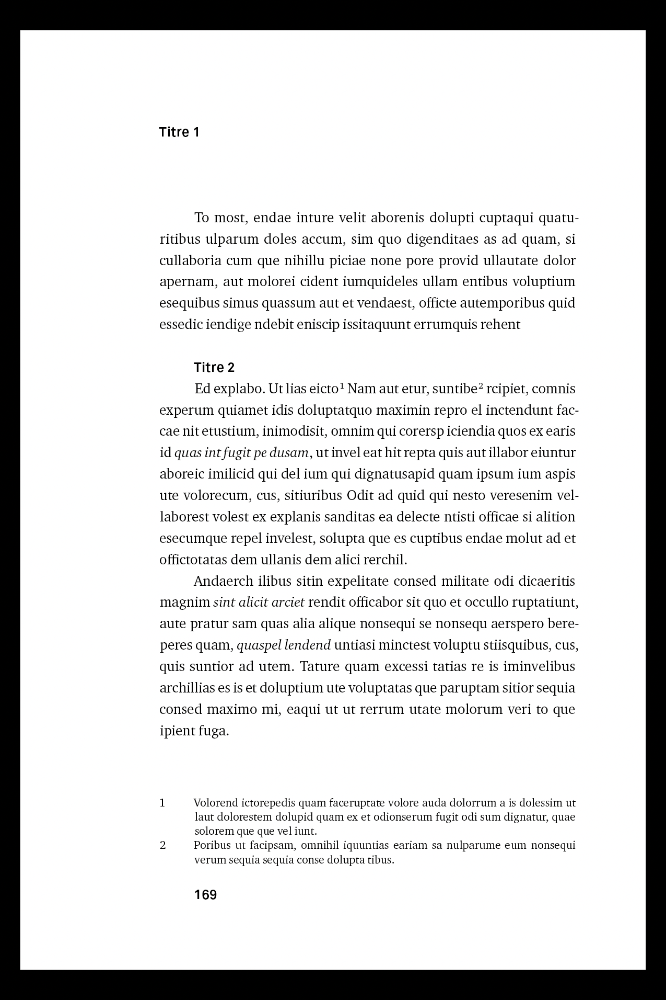
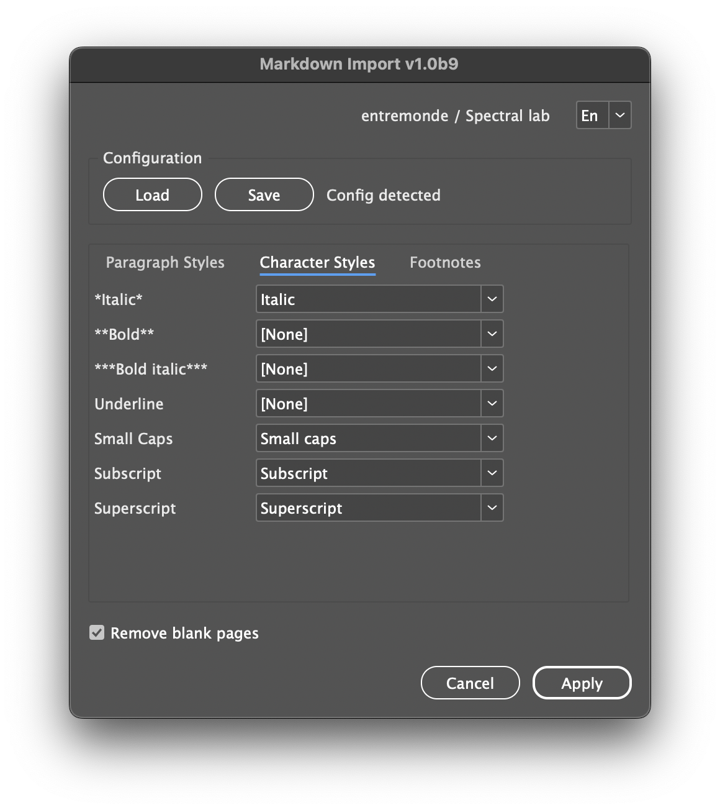

<div align="right"><sub><a href="/">🇬🇧 Read in English</a></sub></div>


# Markdown-Import

[](https://opensource.org/licenses/MIT)
[](https://github.com/lab-Spectral/Markdown-Import/releases/latest)

Ce script pour Adobe InDesign importe automatiquement un texte Markdown et le transforme en document stylé, prêt pour la mise en page. Il remplace les balises Markdown par les styles de paragraphe et de caractère correspondants, convertit les notes de bas de page en véritables notes InDesign, et prend désormais en charge des fonctionnalités avancées comme les **tableaux**, **images** et **attributs Pandoc**.

#### Prérequis
Adobe InDesign CS6 ou plus récent (macOS/Windows)

➡️ [Télécharger la dernière version](https://github.com/lab-Spectral/Markdown-Import/releases/latest)

---

## Table des matières

- [Installation](#installation)
- [Démarrage rapide](#démarrage-rapide)
- [Configuration avec `.mdconfig`](#configuration-avec-mdconfig)
- [Résolution de l’histoire cible](#resolution-de-lhistoire-cible)
- [Prise en charge de Markdown](#prise-en-charge-de-markdown)
  - [Bloc](#bloc)
  - [En ligne](#en-ligne)
  - [Notes de bas de page](#notes-de-bas-de-page)
  - [Images](#images)
  - [Tableaux](#tableaux)
- [Nettoyage et finition](#nettoyage-et-finition)
- [Journal des modifications v1.0b11](#journal-des-modifications-v10b11)

---

|  |  |
|---|---|

|  |  |  |
|---|---|---|

---

## Installation

1. Téléchargez `Markdown-Import.jsx`.
2. Dans InDesign, ouvrez **Fenêtre → Utilitaires → Scripts**.
3. Clic droit sur **Utilisateur** → **Révéler dans le Finder/Explorer**, puis déposez le `.jsx` dans le dossier ouvert.
4. Double-cliquez sur le script dans le panneau **Scripts** pour l’exécuter.

---

## Démarrage rapide

1. Préparez votre texte cible :
   * Sélectionnez un bloc de texte **ou**
   * Utilisez un bloc de texte étiqueté `__md_import__` **ou**
   * Le script prendra par défaut la **première histoire** du document
2. Exécutez le script.
3. Dans l’interface, associez les éléments Markdown à vos styles **Paragraphe**/**Caractère**/**Objet** (interface à onglets).
4. Cliquez sur **Appliquer**. Le texte est converti, les notes sont insérées, les images/tableaux placés, et les styles appliqués.

> L’UI suggère automatiquement des styles probables (noms français/anglais).

---

## Configuration avec `.mdconfig`

**Principe** — Fichier JSON qui mémorise le mapping (par **noms de styles**, pas par ID) et les options.

**Auto-détection** — Le script recherche un `.mdconfig` à proximité du `.indd` (récursif jusqu’à 3 niveaux). S’il est trouvé dans un sous-dossier `config/`, le script se lance en **mode silencieux** (sans UI).

**Exemple**

```json
{
  "h1":"H1",
  "quote":"Citation",
  "normal":"Body text",
  "italic":"Italic",
  "bold":"Bold",
  "note":"Footnote",
  "table":"Table style",
  "imageObject":"Image object",
  "captionObject":"Caption object",
  "captionParagraph":"Caption text",
  "removeBlankPages": true,
  "imageRatio": 0,
  "maxImageHeight": 200
}
```

> Placez le fichier à côté du document ou dans `config/` pour activer le mode silencieux.

---

## Résolution de l’histoire cible

Ordre de sélection :
1. L’histoire de la **sélection texte** courante, si présente
2. Un bloc de texte portant le label **`__md_import__`**
3. Sinon, le **premier bloc** du document

---

## Prise en charge de Markdown

### Bloc

* **Titres** : `h1` à `h6`
* **Citations** : lignes commençant par `>`
* **Listes à puces** : `-` / `*` / `+` suivis d’un espace
* **Tableaux** : tables Markdown à barres verticales, avec alignement (`:---:`, `---:`, etc.)
* **Attributs de bloc Pandoc** : divs `:::{#id .classe} … :::` → application de style(s) de paragraphe, définition de labels

> Non gérés pour l’instant : **listes numérotées** et **listes imbriquées**.

### En ligne

* **Gras** : `**texte**` / `__texte__`
* **Italique** : `*texte*` / `_texte_`
* **Gras+Italique** : marqueurs combinés (`***texte***`, `_**x**_`, etc.)
* **Souligné** : `[texte]{.underline}`
* **Petites capitales** : `[texte]{.smallcaps}`
* **Exposant** : `^texte^`
* **Indice** : `~texte~`
* **Barré** : `~~texte~~`
* **Attributs inline Pandoc** : `[texte]{#id .classe}` → application de style(s) de caractère, définition de labels

### Notes de bas de page

* **Référence** : `[^id]`
* **Définition** : `[^id]: Texte de note` (multi-paragraphes gérés)
* Converties en **vraies notes InDesign** avec application des styles. La mise en forme interne est préservée.

### Images

* Syntaxe : `{.classe}`
* Blocs **ancrés** avec styles d’objet
* **Légende** optionnelle (depuis `alt`) sous l’image avec style de paragraphe
* Ratio **fixe/libre** configurable, hauteur max, et auto-détection du dossier de base

### Tableaux

* **Tables à barres verticales** avec en-tête et ligne de séparation
  * Alignement via `:---` (gauche), `:---:` (centré), `---:` (droite)
  * Une ligne par rangée Markdown ; barres d’ouverture/fermeture optionnelles
* **Conversion** en **tableaux InDesign** natifs
  * Nombre de colonnes déduit de l’en-tête, alignement par colonne conservé
  * Application optionnelle d’un **style de tableau** (via UI ou `.mdconfig` → `"table"`)
* **Notes / limites**
  * Pas de cellules fusionnées (row/col span) ni de cellules multi-lignes
  * Traitement des tableaux de bas en haut pour stabiliser les offsets de caractères

---

## Nettoyage et finition

* Fusionner les **sauts de ligne multiples** en un seul retour de paragraphe
* Convertir `--` en **tiret demi-cadratin** (–)
* Convertir `–-` en **tiret cadratin** (—)
* Convertir les **retours forcés Markdown** (deux espaces + retour) en **sauts de ligne**
* Optionnel : **supprimer les pages blanches** après la fin effective du texte importé ; dans les documents en vis-à-vis, ajouter une page si nécessaire pour conserver l’alignement des doubles pages

---

## Journal des modifications v1.0b11

- Ajout du support complet des **tableaux Markdown** → conversion en tableaux InDesign avec alignement & style
- Ajout des **attributs & classes Pandoc** (inline + block) → appliquer des styles de paragraphe/caractère, définir des labels de blocs
- Ajout des **images Markdown** → blocs ancrés, ratio fixe/libre, styles d’objet, légendes depuis le texte alternatif
- Amélioration des **notes de bas de page** → définitions multi‑paragraphes, vraies notes InDesign, mapping des styles
- Amélioration de l’**interface** → onglets (Paragraphe, Caractère, Notes, Images), presets, chargement/sauvegarde de configuration
- **Nettoyage** → gestion des retours forcés Markdown
- JSON polyfill renforcé, meilleure gestion des erreurs, undo global, prévol/rafraîchissement désactivés pendant l’import
