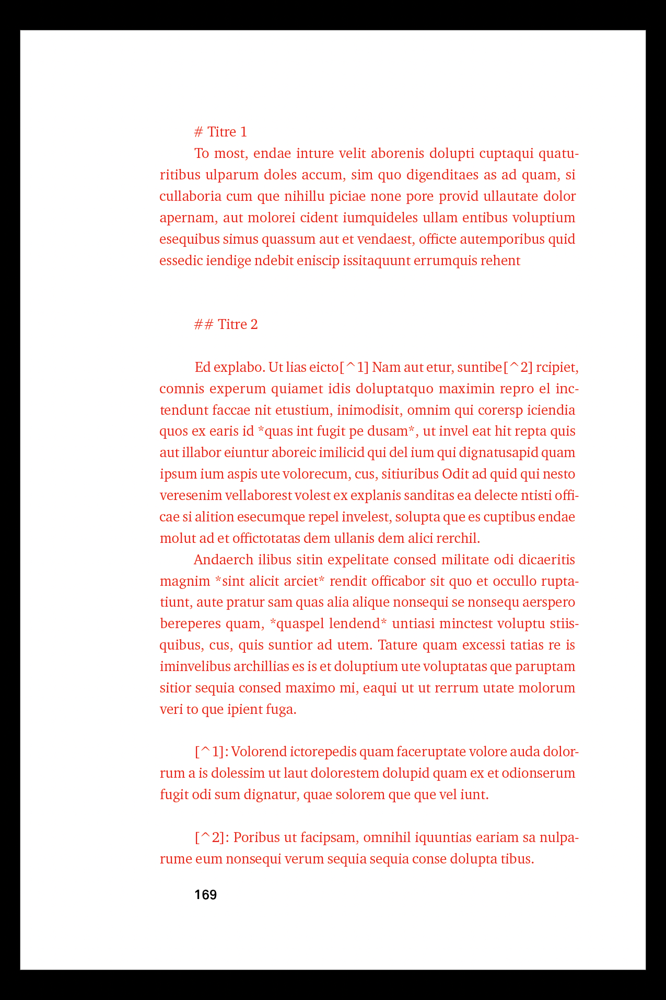
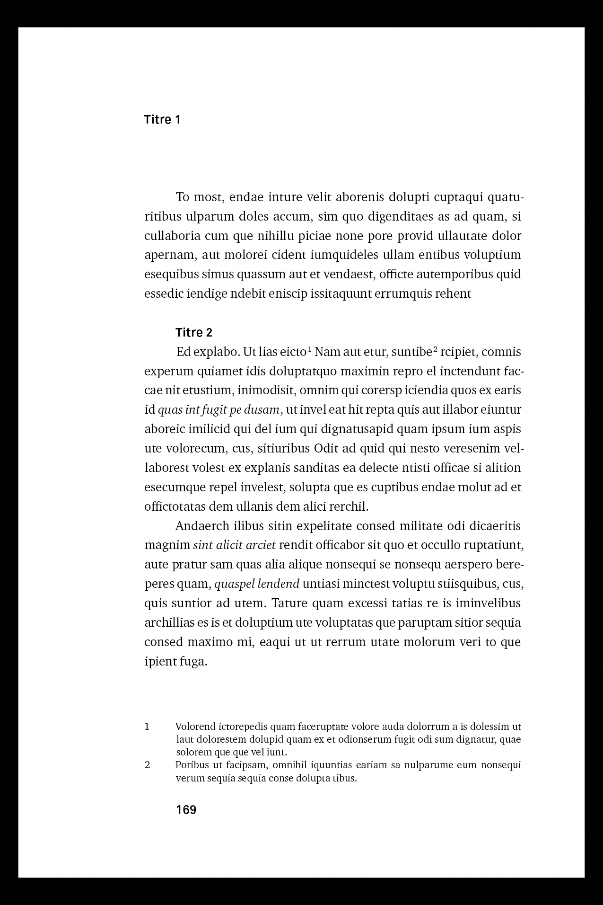
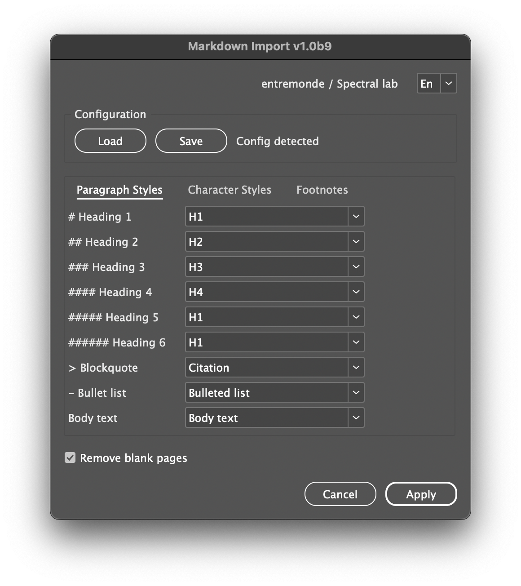
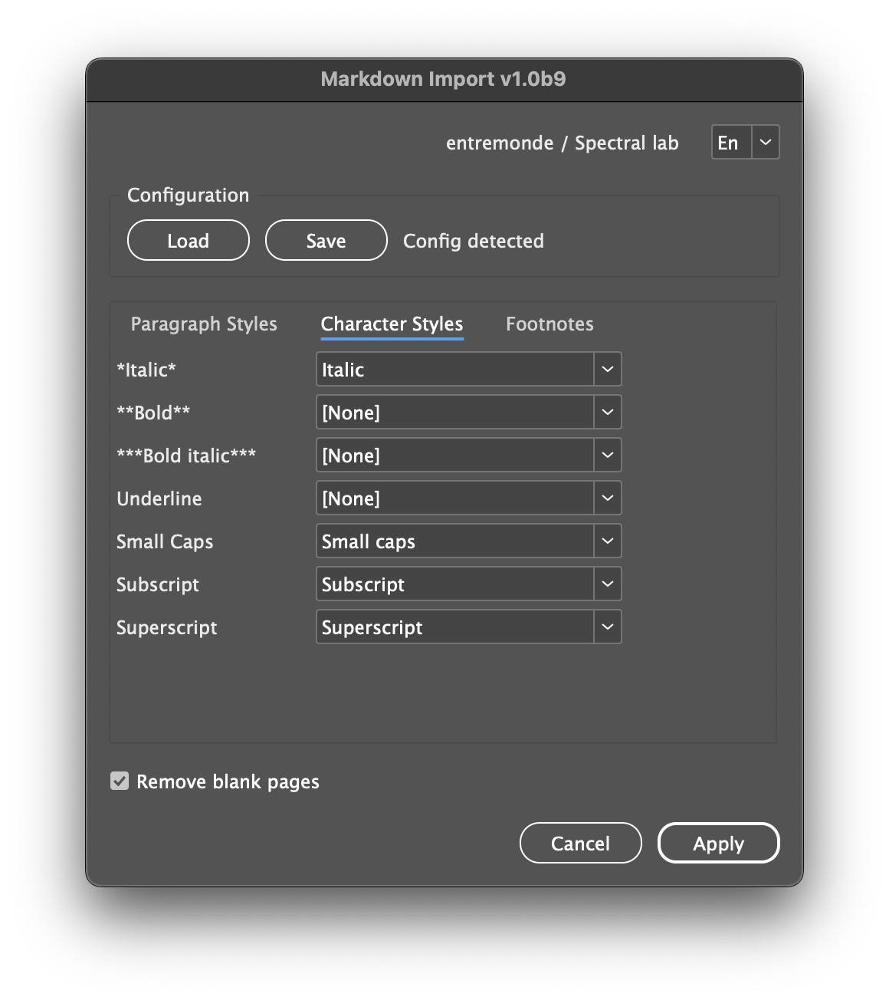
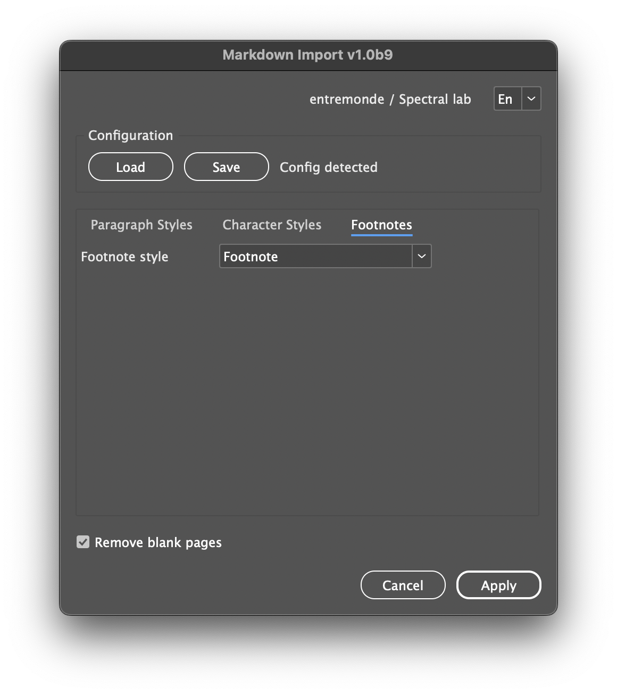

<div align="right"><sub><a href="README.fr.md">🇫🇷 Lire en français</a></sub></div>


# Markdown-Import

[](https://opensource.org/licenses/MIT)
[](https://github.com/lab-Spectral/Markdown-Import/releases/latest)

This script for Adobe InDesign automatically imports and transforms a Markdown text into a styled document, ready for layout. It replaces Markdown tags with the corresponding paragraph and character styles, converts Markdown footnotes into actual InDesign footnotes, and now supports advanced features like tables, images, and Pandoc attributes.

#### Requirements
Adobe InDesign CS6 or newer (macOS/Windows)

➡️ [Download latest release](https://github.com/lab-Spectral/Markdown-Import/releases/latest)


## Table of Contents

- [Installation](#installation)
- [Quick Start](#quick-start)
- [Configuration with `.mdconfig`](#configuration-with-mdconfig)
- [Target Story Resolution](#target-story-resolution)
- [Markdown Support](#markdown-support)
  - [Block-level](#block-level)
  - [Inline](#inline)
  - [Footnotes](#footnotes)
  - [Images](#images)
  - [Tables](#tables)
- [Cleanup & Finishing](#cleanup--finishing)
- [Changelog v1.0b11](#changelog-v10b11)

---

---

|  |  |
|---|---|

|  |  |  |
|---|---|---|

---

## Installation

1. Download `Markdown-Import_v1.0b12a.jsx`.
2. In InDesign, open **Window → Utilities → Scripts**.
3. Right-click **User** → **Reveal in Finder/Explorer**, then drop the `.jsx` into the opened folder.
4. Double-click the script in the **Scripts** panel to run it.

---

## Quick Start

1. Prepare your target text:

   * Select a text frame **or**
   * Use a text frame labeled `__md_import__` **or**
   * The script will fall back to the **first story** in the document
2. Run the script.
3. In the UI, map Markdown elements to your **Paragraph**/**Character**/**Object** styles (tabbed interface).
4. Click **Apply**. The text is converted, footnotes are inserted, images/tables are placed, and styles are applied.

> The UI suggests likely styles automatically (French/English names).

---

## Configuration with `.mdconfig`

**What it is** — A JSON file that saves the mapping (by **style names**, not IDs) and options.

**Autodetection** — The script searches for a `.mdconfig` near your `.indd` (recursive up to 3 levels). If found under a `config/` subfolder, the script runs in **silent mode** (no UI).

**Example**

```json
{
  "h1":"H1",
  "quote":"Citation",
  "normal":"Body text",
  "italic":"Italic",
  "bold":"Bold",
  "note":"Footnote",
  "table":"Table style",
  "imageObject":"Image object",
  "captionObject":"Caption object",
  "captionParagraph":"Caption text",
  "removeBlankPages":true,
  "imageRatio":0,
  "maxImageHeight":200
}
```

> Place the file next to the document or under `config/` for silent mode.

---

## Target Story Resolution

The script chooses the target story in this order:

1. The story of the **current text selection**, if any
2. A text frame labeled **`__md_import__`**
3. Otherwise, the **first text frame** in the document

---

## Markdown Support

### Block-level

* **Headings**: `h1` to `h6`
* **Blockquotes**: lines starting with `>`
* **Bulleted lists**: `-` / `*` / `+` followed by a space
* **Tables**: pipe-separated Markdown tables with alignment (`:---:`, `---:`, etc.)
* **Pandoc block attributes**: fenced divs `:::{#id .class}` … `:::` → apply paragraph style(s), set frame labels

> Not supported yet: **ordered lists** and **nested lists**.

### Inline

* **Bold**: `**text**` / `__text__`
* **Italic**: `*text*` / `_text_`
* **Bold+Italic**: combined markers (`***text***`, `_**x**_`, etc.)
* **Underline**: `[text]{.underline}`
* **Small caps**: `[text]{.smallcaps}`
* **Superscript**: `^text^`
* **Subscript**: `~text~`
* **Strikethrough**: `~~text~~`
* **Pandoc inline attributes**: `[text]{#id .class}` → apply character style(s), set labels

### Footnotes

* **Reference**: `[^id]`
* **Definition**: `[^id]: Note text` (multi-paragraph supported)
* Converted to native InDesign footnotes with applied styles. Formatting inside footnotes is preserved.

### Images

* Markdown syntax: `{.class}`
* Anchored frames with object styles
* Optional caption (from `alt`) below the image with paragraph style
* Configurable aspect ratio (fixed/free), max height, and base folder autodetection

### Tables

* **Pipe tables** with header and ruler line
  * Alignment via `:---` (left), `:---:` (center), `---:` (right)
  * One row per Markdown line; leading/trailing pipes optional
* **Conversion** to native InDesign tables
  * Column count inferred from header, per‑column alignment preserved
  * Optional **Table Style** application (via UI or `.mdconfig` → `"table"`)
* **Notes / limitations**
  * No merged cells (row/col span) or multi‑line cells
  * Tables are processed bottom‑to‑top to keep character offsets stable

---

## Cleanup & Finishing

* Collapse **multiple line breaks** to a single paragraph break
* Convert `--` to an **en-dash** (–)
* Convert `–-` to an **em-dash** (—)
* Convert Markdown hard breaks (two spaces + return) to line breaks
* Optional: **remove blank pages** after the actual end of the imported story; in facing-pages documents, add a page if needed to keep spreads aligned

---

## Changelog v1.0b11

- Add full **Markdown table support** → convert to InDesign tables w/ alignment & style
- Add **Pandoc attributes & classes** (inline + block) → apply paragraph/character styles, set frame labels
- Add **Markdown images** → anchored frames, ratio fixed/free, object styles, captions from alt text
- Improve **footnotes** → multi-paragraph definitions, real InDesign footnotes, style mapping
- Enhance **UI** → tabbed interface (Paragraph, Character, Footnotes, Images), presets, load/save config
- **Cleanup** → support for Markdown hard line breaks
- Safer **JSON polyfill**, better error handling, full undo support, preflight/redraw off during import
